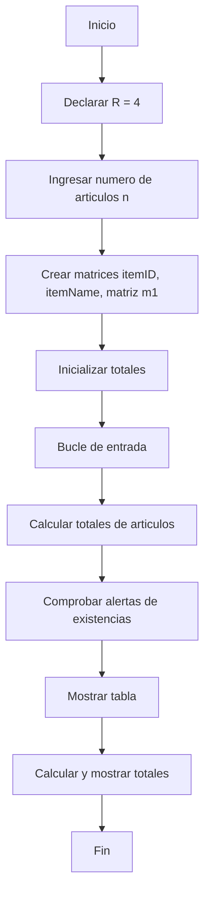
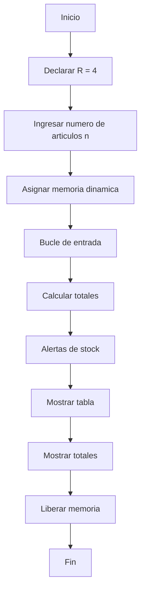
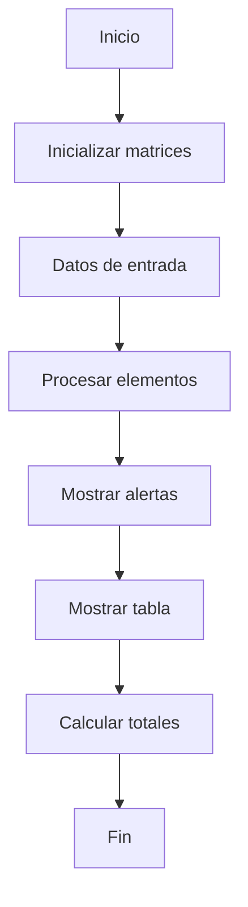
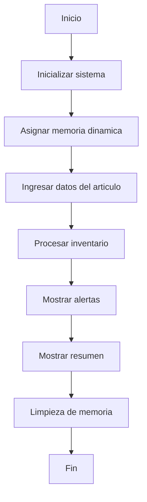

# Practicas de taller de C++

Este repositorio contiene una coleccion de practicas en C++ centradas en sistemas de gestion de inventario.

## Practica 4 - Sistema Basico de Inventario

### Descripcion
Un sistema sencillo de gestion de inventario que utiliza matrices estaticas que:
- Almacena los ID y nombres de los articulos
- Controla los niveles y limites de existencias
- Calcula precios unitarios y valores totales
- Proporciona alertas de existencias cuando los niveles estan por debajo de los limites

### Diagrama de flujo

## Practica 5 - Inventario con Memoria Dinamica

### Descripcion
Una version mejorada de la Practica 4 con asignacion dinamica de memoria:
- Utiliza matrices dinamicas para los datos de los articulos
- Implementa una gestion adecuada de la memoria
- Mantiene la misma funcionalidad que la Practica 4
- Incluye limpieza de memoria

### Diagrama de flujo

## Practica 6 - Inventario con Matriz Fija

### Descripcion
Una variacion que utiliza matrices de tamano fijo:
- Utiliza matrices 2D para la informacion de los articulos
- Implementa la gestion de existencias
- Calcula los valores del inventario
- Proporciona alertas de stock

### Diagrama de flujo

## Practica 7 - Inventario Dinamico Avanzado

### Descripcion
La version mas sofisticada con:
- Gestion totalmente dinamica de la memoria
- Organizacion mejorada de los datos
- Interfaz de usuario mejorada
- Seguimiento completo del inventario

### Diagrama de flujo

## Caracteristicas Comunes en Todas las Practicas

- Seguimiento del nivel de existencias
- Calculo de precios
- Alertas de inventario
- Visualizacion de datos en tablas
- Calculo del valor total
