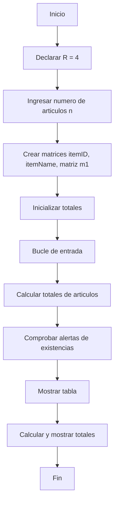
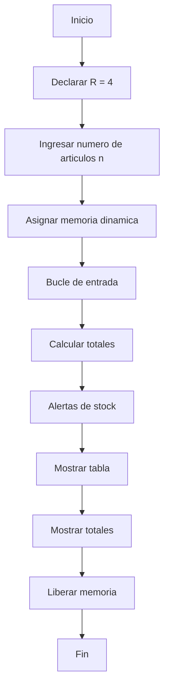
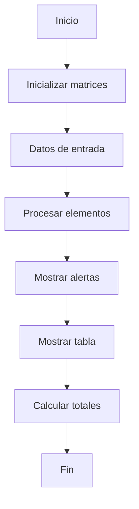
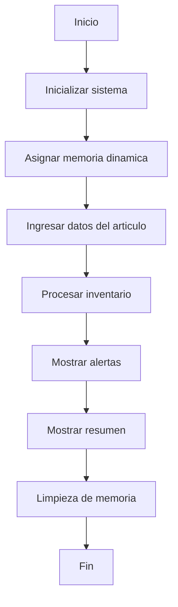

# Prácticas de taller de C++

Este repositorio contiene una colección de prácticas en C++ centradas en sistemas de gestión de inventario.

## Práctica 4 - Sistema Básico de Inventario

### Descripción
Un sistema sencillo de gestión de inventario que utiliza matrices estáticas que:
- Almacena los ID y nombres de los artículos
- Controla los niveles y límites de existencias
- Calcula precios unitarios y valores totales
- Proporciona alertas de existencias cuando los niveles están por debajo de los límites

### Diagrama de flujo

## Práctica 5 - Inventario con Memoria Dinámica

### Descripción
Una versión mejorada de la Práctica 4 con asignación dinámica de memoria:
- Utiliza matrices dinámicas para los datos de los artículos
- Implementa una gestión adecuada de la memoria
- Mantiene la misma funcionalidad que la Práctica 4
- Incluye limpieza de memoria

### Diagrama de flujo

## Práctica 6 - Inventario con Matriz Fija

### Descripción
Una variación que utiliza matrices de tamaño fijo:
- Utiliza matrices 2D para la información de los artículos
- Implementa la gestión de existencias
- Calcula los valores del inventario
- Proporciona alertas de stock

### Diagrama de flujo

## Práctica 7 - Inventario Dinámico Avanzado

### Descripción
La versión más sofisticada con:
- Gestión totalmente dinámica de la memoria
- Organización mejorada de los datos
- Interfaz de usuario mejorada
- Seguimiento completo del inventario

### Diagrama de flujo

## Características Comunes en Todas las Prácticas

- Seguimiento del nivel de existencias
- Cálculo de precios
- Alertas de inventario
- Visualización de datos en tablas
- Cálculo del valor total
